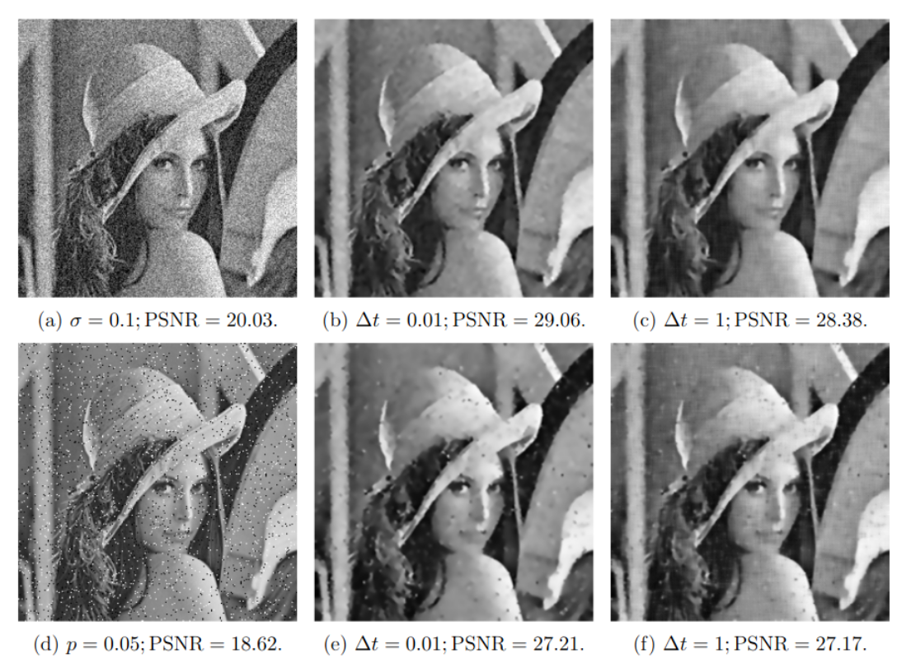

# Lattice Boltzmann Method with stopping criterion for Image Denoising

This project presents a numerical experiment utilizing the five-speed lattice Boltzmann method (LBM D2Q5) to solve the Perona-Malik equation for denoising black-and-white images. The focus is on filtering Gaussian noise with zero mean and salt-and-pepper noise, assessing restoration quality through peak signal-to-noise ratio (PSNR). A decorrelation criterion for stopping the iterative algorithm is considered.

## Key Features
- **Noise Types**: Handles both Gaussian and salt-and-pepper noise.
- **Optimal Stopping Criterion**: Implements a decorrelation criterion to determine the optimal stopping time for noise filtering, minimizing correlation between noise estimate and filtered signal.
- **Performance Evaluation**: Evaluate the LBM D2Q5 algorithm's efficiency using the BSD68 dataset.

The `LBM_denoising.ipynb` notebook provides a detailed overview of the experiment, including both visual and numerical analyses confirming the effectiveness of the LBM D2Q5 algorithm in improving PSNR and successfully filtering out noise from images.

## References

1. [P. Perona and J. Malik, «Scale-space and edge detection using anisotropic diffusion», 1990.](https://doi.org/10.1109/34.56205)
2. [W. Zhang and B. Shi, «Application of Lattice Boltzmann Method to Image Filtering», 2012.](https://doi.org/10.1007/s10851-011-0295-x)
3. [P. Mrazek and M. Navara, «Selection of Optimal Stopping Time for Nonlinear Diffusion Filtering», 2003.](https://doi.org/10.1023/A:1022908225256)